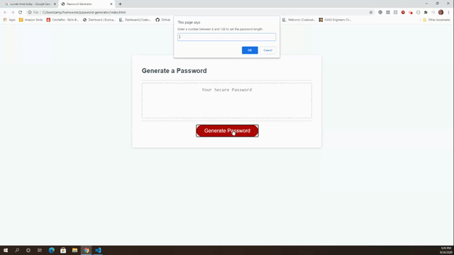

# Password Generator

[Link to Deployed Website](https://jessicablank.github.io/password-generator/)

## Description:  
 This was originally my second homework assignment during coding bootcamp. I remember being disappointed when I submitted this assignment that I didn't have time to add a "copy" button. When I came back to refactor this assignment after bootcamp, I decided to add some additional features. 

    
## Table of Contents:
* [Local Installation](#local-installation)
* [Project Story](#project-story)
* [Questions](#questions)
* [License](#license-info)

## Local Installation
Ready to run in your favorite code editor. Fork, download, or clone. 

## Project Story
#### Original Homework Submission:

#### Refactored:

## Questions
You can reach the author, Jessica Blankemeier,  via [github](http://github.com/jessicablank) and [email](mailto:jessicablankemeier@gmail.com)

## License
Copyright 2020 - present Jessica Blankemeier.
This project is licensed under the terms of the MIT license. 
More information is available at [opensource.org/licenses](https://opensource.org/licenses/MIT)
