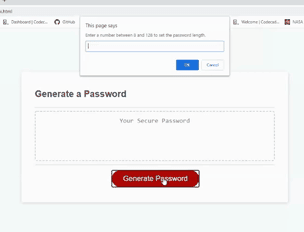

# Password Generator

[Deployed on GitHub Pages: https://jessicablank.github.io/password-generator/](https://jessicablank.github.io/password-generator/)

## Description:  
 This was originally my second homework assignment during coding bootcamp. After bootcamp, I returned and added some fun features. 

    
## Table of Contents:
* [Project Story](#project-story)
* [Local Installation](#local-installation)
* [Technologies Used](#technologies-used)
* [Questions](#questions)
* [License](#license-info)

## Project Story

### MVP
The Minimum Viable Product (MVP) for this assignment required the following to generate a secure password for an internet user:
- Upon clicking the `Generate Password` button, the user must set the password length of at least 8 characters and no more than 128 characters. 
- After confirming the password length, the user must choose lowercase, uppercase, numeric and/or special characters. 
- The input must be validated. 
- The password is either displayed in an alert of written to the page. 

I did my best with vanilla Javascript given starter HTML and CSS. The result was not user-friendly, but it worked as required. 

### Refactored
I returned after bootcamp to add a `copy` button. Once the button successfully copied the password to the clipboard, I started researching other ways to get user input for the password criteria. 

- **Password Length**: Originally the user was required to input a numeric value between 8 and 128 into a field or receive an error. I switched this input to a range slider so the user would not have the opportunity to enter a password length outside of the requirements. The range slider has a default value of 94. This allows the user to create a secure password quickly without any length input. 

- **Uppercase letters, Lowercase Letters, Numbers, and Special Characters**: In the first version, users would click "OK" or "Cancel" on confirm boxes to set these parameters. If none were set, the user would receive an error. By switching to checkboxes, I could add code to eliminate the need for an error message. Now if the user unchecks three parameters, the final checkbox will be disabled and automatically become the default parameter for password generation. 

I added a few more bells and whistles found through Google-Fu. My favorite addition is a waving Octocat link to this GitHub repo. I thought I was done until something AMAZING happened! :sparkles: Another Github user reviewed my code  and noted the card was not mobile-responsive.

I had continued to rely on the starter code during refactoring despite bringing in Bootstrap to style the copy button. The resulting mobile display was cringe-worthy. The header was not visible. Tool tips crowded the screen. It was a mess. 

So huge props to my first contributor. Sawyer recommended vertically aligning the card. I settled on utilizing Bootstrap's built-in mobile responsive capabilities. Now the final product looks nothing like the first version. The output is the same, but the user experience and usefulness is improved! 

I asked some friends for their review. They graciously reported the interface as intuitive and functional. Not as fun as a [random burger generator](https://secure-shore-09876.herokuapp.com/ "Eat Da Burger Project"), but everyone who uses the internet needs a secure password. 

## Local Installation
Ready to run in your favorite code editor. Fork, download, or clone. 

## Technologies Used
- [Bootstrap](https://getbootstrap.com/)
- [Font Awesome](https://fontawesome.com/)
- [patterncooler.com](https://www.patterncooler.com/)

## Questions
You can reach the author, Jessica Blankemeier,  via [github](http://github.com/jessicablank) and [email](mailto:jessicablankemeier@gmail.com)

## License
Copyright 2020 - present Jessica Blankemeier.
This project is licensed under the terms of the MIT license. 
More information is available at [opensource.org/licenses](https://opensource.org/licenses/MIT)
