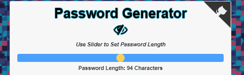
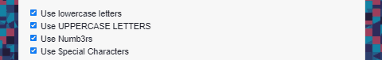

# Password Generator
[](https://opensource.org/licenses/MIT)

[](https://github.com/jessicablank/password-generator/issues)
[](https://github.com/jessicablank/password-generator/stargazers)


[Deployed on GitHub Pages: https://jessicablank.github.io/password-generator/](https://jessicablank.github.io/password-generator/)


## Description:  
 This was originally my second homework assignment during coding boot camp. I returned after classes ended to improve the user experience. 
    
## Table of Contents:
* [Project Story](#project-story)
* [Local Installation](#local-installation)
* [Technologies Used](#technologies-used)
* [File Structure](#file-structure)
* [Questions](#questions)
* [License](#license-info)

## Project Story

### MVP
The Minimum Viable Product (MVP) for this assignment required the following to generate a secure password for an internet user:
- Upon clicking the `Generate Password` button, the user must set the password length of at least 8 characters and no more than 128 characters. 
- After confirming the password length, the user must choose lowercase, uppercase, numeric and/or special characters. 
- The input must be validated. 
- The password is either displayed in an alert or written to the page. 

I added vanilla Javascript given starter code in HTML and CSS. The result worked as required. I received an "A" on the assignment.

I had recently learned how to use the project management features of GitHub, so I created an issue for myself to update this project with a `copy` button to copy the randomly generated password to the clipboard. 


### Refactored
Once I returned to this project, I realized I now had the skills and knowledge to make this project more functional. I decided to improve the overall user experience while meeting the project requirements. 

- **Password Length**: Originally the user was required to input a numeric value between 8 and 128 into a field. The user would receive an error message if the numeric value entered was outside of those range parameters. Changing this input method to a **range slider** eliminates the need for an error message, 



- **Uppercase letters, Lowercase Letters, Numbers, and Special Characters**: In the first version, users would click "OK" or "Cancel" on confirm boxes to set these parameters. If none were set, the user would receive an error. By switching to **checkboxes**, I could add code to eliminate the need for an error message. Now if the user unchecks three parameters, the final checkbox will be disabled and automatically become the default parameter for password generation. 



- **Octocat**: My favorite addition found through Google-Fu is a waving Octocat link to this GitHub repo.


- **Mobile-Responsive**: Something AMAZING happened! :sparkles: Another Github user forked and reviewed my project. Sawyer noted the card was not mobile-responsive. **Thank You Sawyer!** I completed the Bootstrap styling implementation and removed unnecessary CSS to allow for mobile-responsive display.  

- **User-Review**: I sent the link via text to friends for their review. They graciously reported the interface as intuitive and functional. One user, **Jameson**, said:

> I spent a sad amount of time trying to get it to make a real word at 8 characters and was not successful. So...it works!
 
All my test users agree this is not as fun as a [random burger generator](https://secure-shore-09876.herokuapp.com/ "Eat Da Burger Project"), but they agreed this is a useful application for quickly generating a secure password. 


## Local Installation
Ready to run in your favorite code editor. Fork, download, or clone. 

## Technologies Used
- [Bootstrap](https://getbootstrap.com/)
- [Font Awesome](https://fontawesome.com/)
- [patterncooler.com](https://www.patterncooler.com/)

## File Structure

```
├── assets
|  ├── copyBtn.js <--Handles Copy Button Functionality-->
|  ├── favicon.ico
|  ├── images
|  ├── pwGen.js <--Handles password criteria inputs and generates output -->
|  └── style.css
├── index.html
└── README.md
```

## Questions
You can reach the author, Jessica Blankemeier, via [jessicablankemeier@gmail.com](mailto:jessicablankemeier@gmail.com)


## License
Copyright 2020 - present Jessica Blankemeier.
This project is licensed under the terms of the MIT license. 
More information is available at [opensource.org/licenses](https://opensource.org/licenses/MIT)
